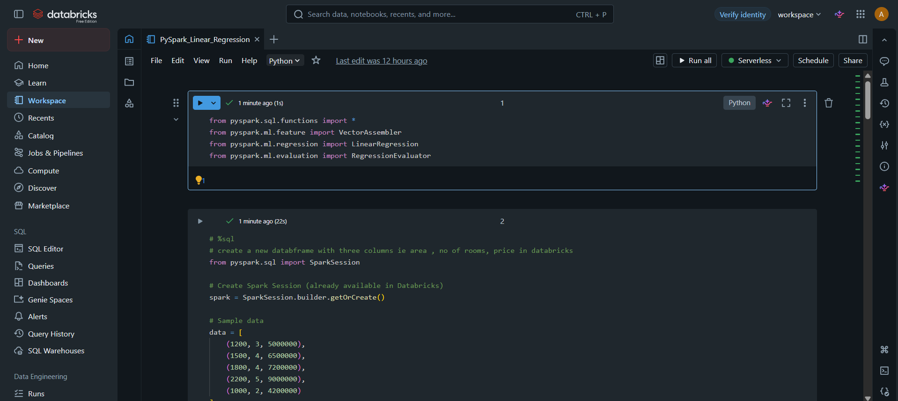
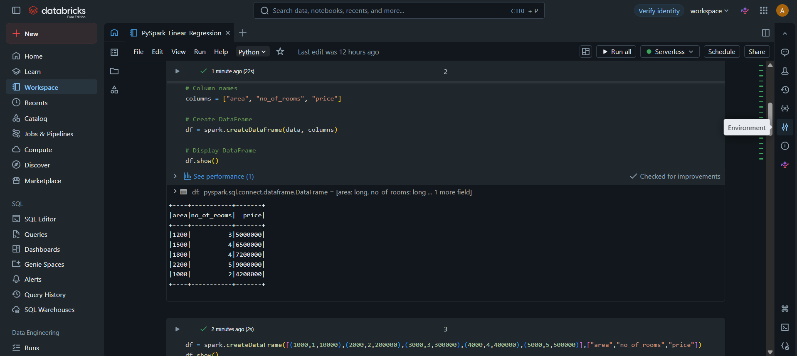
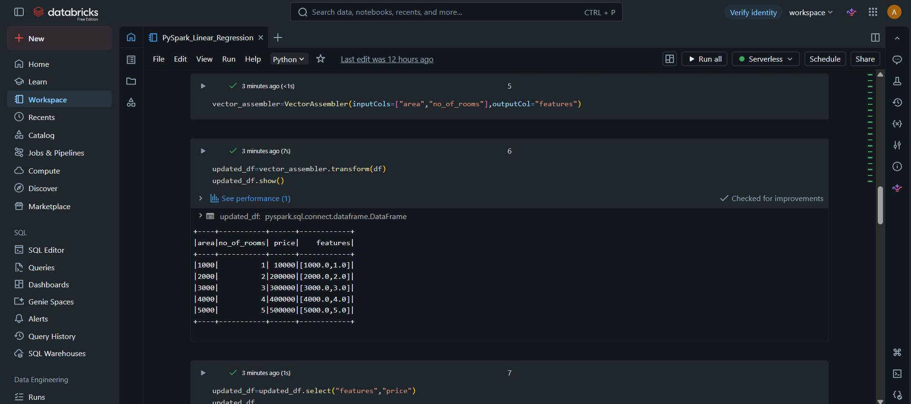
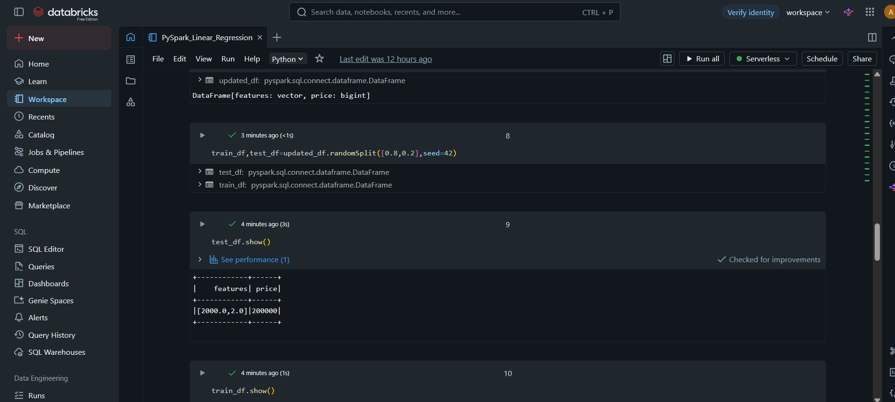
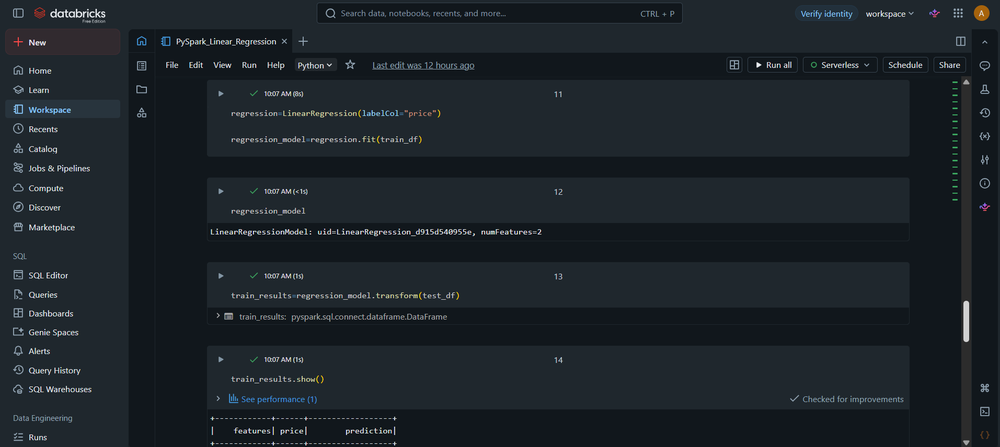
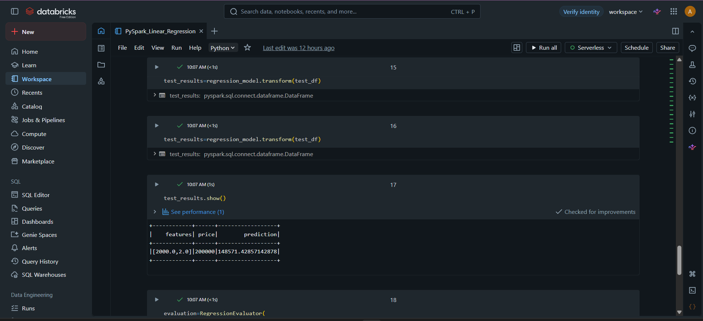
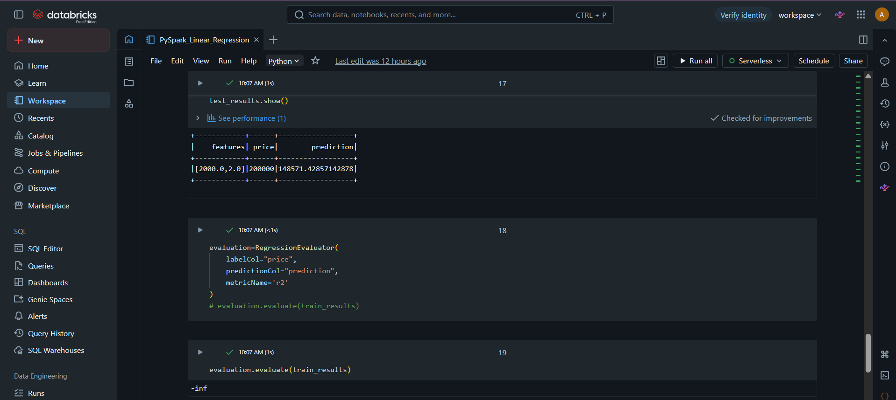

# Linear Regression using PySpark MLlib

## Overview

This project demonstrates how to build a Linear Regression model using PySpark MLlib in Databricks.

## Technologies Used

- Python
- PySpark
- Apache Spark
- Spark MLlib
- Databricks

## Workflow

### 1. Project Setup

### 2. Creating the Dataset

### 3. Feature Engineering

### 4. Train-Test Split

### 5. Model Training

### 6. Prediction Results

### 7. Model Evaluation

